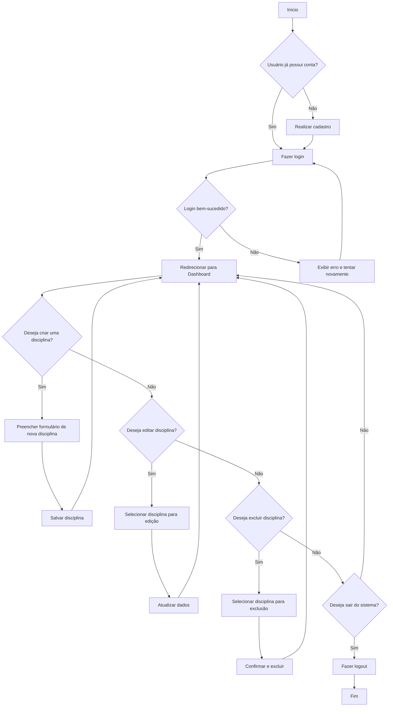

```mermaid
flowchart TD
    A[Início] --> B{Usuário já possui conta?}
    B -- Sim --> C[Fazer login]
    B -- Não --> D[Realizar cadastro]
    D --> C
    C --> E{Login bem-sucedido?}
    E -- Sim --> F[Redirecionar para Dashboard]
    E -- Não --> C2[Exibir erro e tentar novamente]
    C2 --> C
    F --> G{Deseja criar uma disciplina?}
    G -- Sim --> H[Preencher formulário de nova disciplina]
    H --> I[Salvar disciplina]
    I --> F
    G -- Não --> J{Deseja editar disciplina?}
    J -- Sim --> K[Selecionar disciplina para edição]
    K --> L[Atualizar dados]
    L --> F
    J -- Não --> M{Deseja excluir disciplina?}
    M -- Sim --> N[Selecionar disciplina para exclusão]
    N --> O[Confirmar e excluir]
    O --> F
    M -- Não --> P{Deseja sair do sistema?}
    P -- Sim --> Q[Fazer logout]
    Q --> R[Fim]
    P -- Não --> F


```
