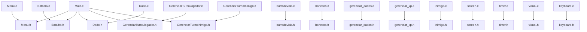

```mermaid
graph TD
    Main.c --> Menu.h
    Main.c --> Batalha.h
    Main.c --> Dado.h
    Main.c --> GerenciarTurnoJogador.h
    Main.c --> GerenciarTurnoInimigo.h

    Batalha.c --> Batalha.h
    Dado.c --> Dado.h
    Menu.c --> Menu.h
    GerenciarTurnoJogador.c --> GerenciarTurnoJogador.h
    GerenciarTurnoInimigo.c --> GerenciarTurnoInimigo.h
    barradevida.c --> barradevida.h
    bonecos.c --> bonecos.h
    gerenciar_dados.c --> gerenciar_dados.h
    gerenciar_xp.c --> gerenciar_xp.h
    inimigo.c --> inimigo.h
    screen.c --> screen.h
    timer.c --> timer.h
    visual.c --> visual.h
    keyboard.c --> keyboard.h

```
