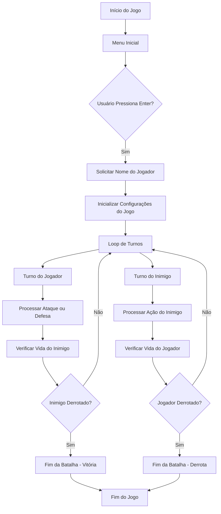

```mermaid
graph TD
    A[Início do Jogo] --> B[Menu Inicial]
    B --> C{Usuário Pressiona Enter?}
    C -- Sim --> D[Solicitar Nome do Jogador]
    D --> E[Inicializar Configurações do Jogo]
    E --> F[Loop de Turnos]

    F --> G[Turno do Jogador]
    G --> H[Processar Ataque ou Defesa]
    H --> I[Verificar Vida do Inimigo]

    F --> J[Turno do Inimigo]
    J --> K[Processar Ação do Inimigo]
    K --> L[Verificar Vida do Jogador]

    I --> M{Inimigo Derrotado?}
    L --> N{Jogador Derrotado?}

    M -- Sim --> O[Fim da Batalha - Vitória]
    N -- Sim --> P[Fim da Batalha - Derrota]

    M -- Não --> F
    N -- Não --> F

    O --> Q[Fim do Jogo]
    P --> Q
```
